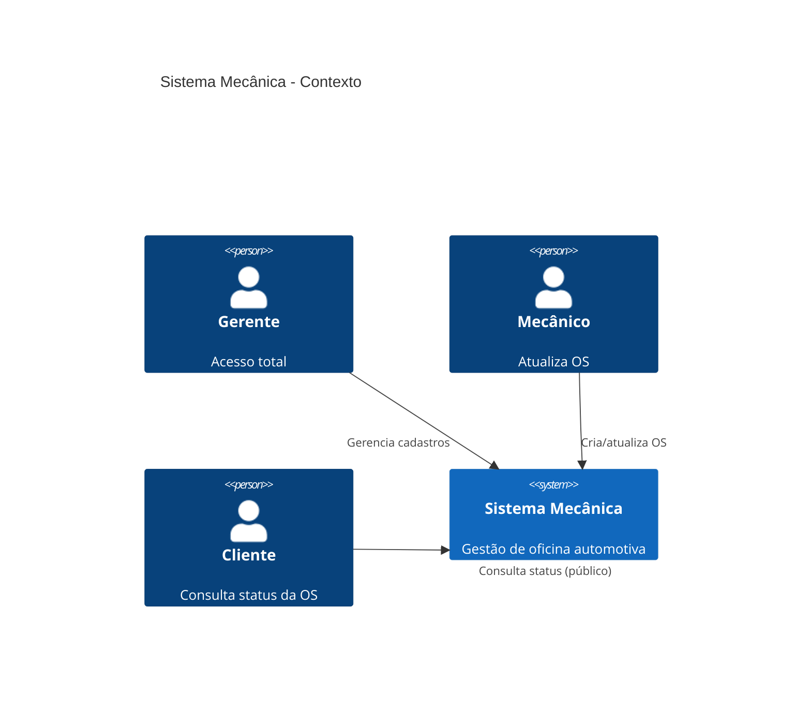
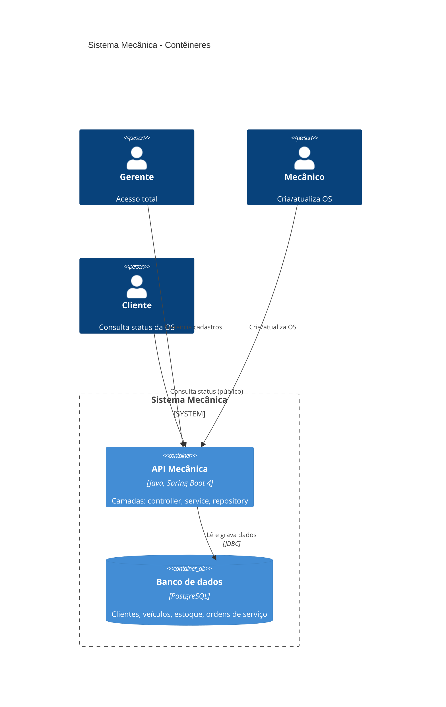
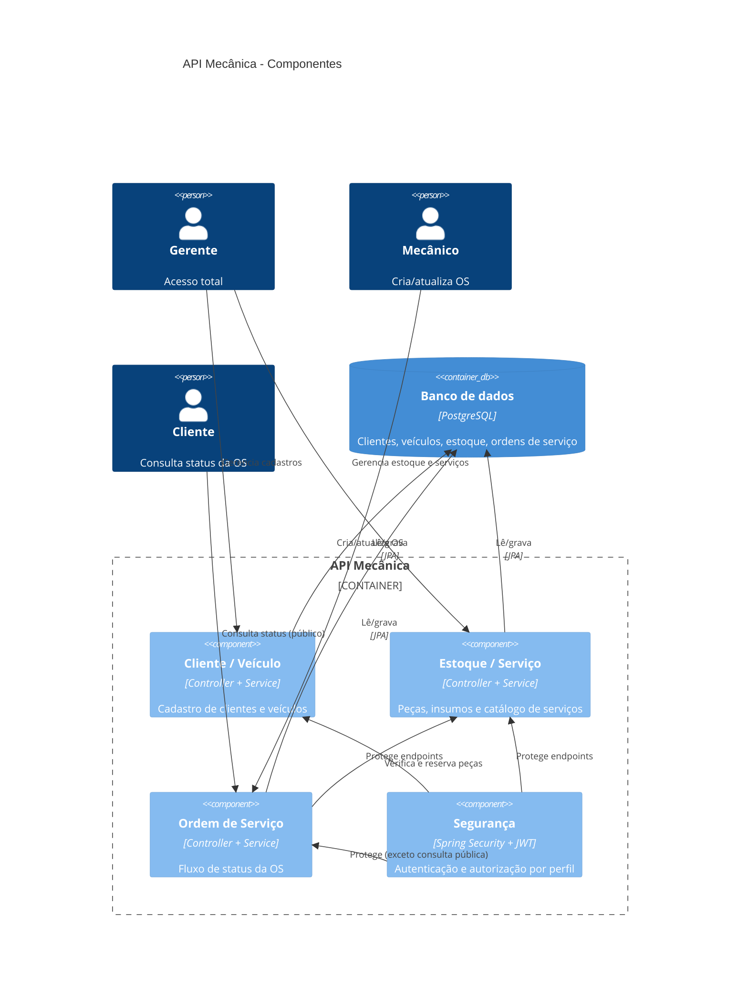

```mermaid
---
config:
  theme: default
---
C4Context
  title Sistema Mecânica - Contexto

  Person(gerente, "Gerente", "Acesso total")
  Person(mecanico, "Mecânico", "Atualiza OS")
  Person(cliente, "Cliente", "Consulta status da OS")

  System(sistema, "Sistema Mecânica", "Gestão de oficina automotiva")

  Rel(gerente, sistema, "Gerencia cadastros")
  Rel(mecanico, sistema, "Cria/atualiza OS")
  Rel(cliente, sistema, "Consulta status (público)")

  UpdateLayoutConfig($c4ShapeInRow="2", $c4BoundaryInRow="1")

  UpdateRelStyle(gerente, sistema, $offsetX="-80", $offsetY="20")
  UpdateRelStyle(mecanico, sistema, $offsetY="20")
  UpdateRelStyle(cliente, sistema, $offsetX="80", $offsetY="20")
  UpdateElementStyle(sistema, $offsetX="170")
```

```mermaid
---
config:
  theme: default
---
C4Container
  title Sistema Mecânica - Contêineres

  Person(gerente, "Gerente", "Acesso total")
  Person(mecanico, "Mecânico", "Cria/atualiza OS")
  Person(cliente, "Cliente", "Consulta status da OS")

  System_Boundary(sistema, "Sistema Mecânica") {
    Container(api, "API Mecânica", "Java, Spring Boot 4", "Camadas: controller, service, repository")
    ContainerDb(db, "Banco de dados", "PostgreSQL", "Clientes, veículos, estoque, ordens de serviço")
  }

  Rel(gerente, api, "Gerencia cadastros")
  Rel(mecanico, api, "Cria/atualiza OS")
  Rel(cliente, api, "Consulta status (público)")
  Rel(api, db, "Lê e grava dados", "JDBC")

  UpdateLayoutConfig($c4ShapeInRow="3", $c4BoundaryInRow="1")
```

```mermaid
---
config:
  theme: default
---
C4Component
  title API Mecânica - Componentes

  Person(gerente, "Gerente", "Acesso total")
  Person(mecanico, "Mecânico", "Cria/atualiza OS")
  Person(cliente, "Cliente", "Consulta status da OS")

  Container_Boundary(api, "API Mecânica") {
    Component(clienteComp, "Cliente / Veículo", "Controller + Service", "Cadastro de clientes e veículos")
    Component(estoqueComp, "Estoque / Serviço", "Controller + Service", "Peças, insumos e catálogo de serviços")
    Component(osComp, "Ordem de Serviço", "Controller + Service", "Fluxo de status da OS")
    Component(security, "Segurança", "Spring Security + JWT", "Autenticação e autorização por perfil")
  }

  ContainerDb(db, "Banco de dados", "PostgreSQL", "Clientes, veículos, estoque, ordens de serviço")

  Rel(gerente, clienteComp, "Gerencia cadastros")
  Rel(gerente, estoqueComp, "Gerencia estoque e serviços")
  Rel(mecanico, osComp, "Cria/atualiza OS")
  Rel(cliente, osComp, "Consulta status (público)")

  Rel(osComp, estoqueComp, "Verifica e reserva peças")
  Rel(clienteComp, db, "Lê/grava", "JPA")
  Rel(estoqueComp, db, "Lê/grava", "JPA")
  Rel(osComp, db, "Lê/grava", "JPA")

  Rel(security, clienteComp, "Protege endpoints")
  Rel(security, estoqueComp, "Protege endpoints")
  Rel(security, osComp, "Protege (exceto consulta pública)")

  UpdateLayoutConfig($c4ShapeInRow="3", $c4BoundaryInRow="1")
```